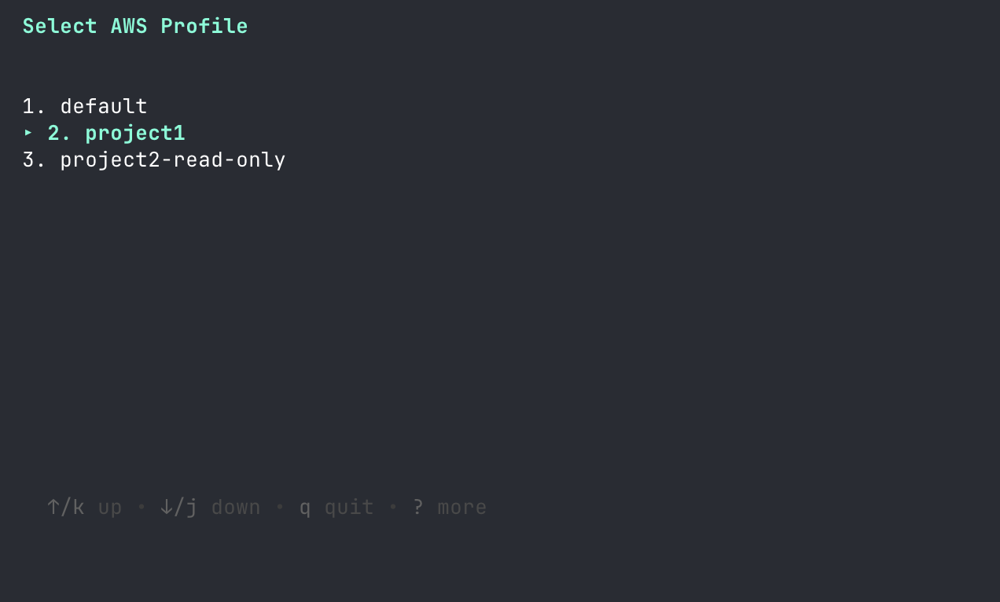
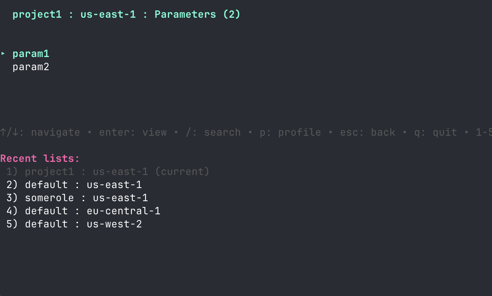
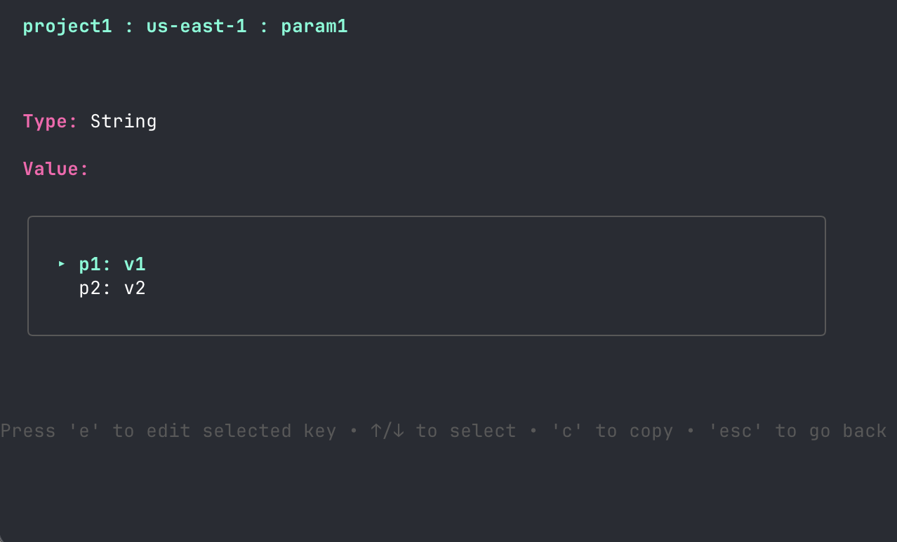
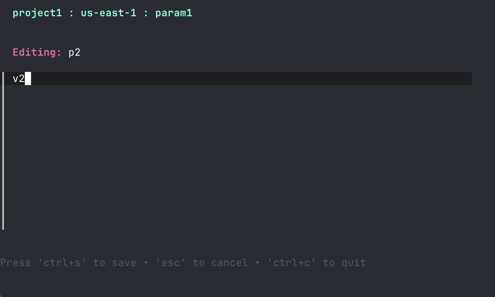

# PS9S - AWS Parameter Store TUI

A beautiful terminal user interface (TUI) for managing AWS Systems Manager Parameter Store parameters across multiple AWS profiles.

## Screenshots

    

## Features

- **Multi-Profile Support**: Seamlessly switch between multiple AWS profiles and regions
- **Recent Contexts**: Remembers your last 5 profile/region combinations for quick switching (1-5 keys)
- **Search & Filter**: Quickly find parameters with real-time search
- **View & Edit**: View parameter details and edit values inline
- **JSON Support**: View, edit, and add individual JSON keys within parameter values
- **Copy to Clipboard**: Press 'c' to copy values to your system clipboard
- **SecureString Support**: Automatically decrypts SecureString parameters (requires KMS permissions)

## Installation

### Homebrew

```bash
brew tap caseycs/ps9s
brew install ps9s
```

## Prerequisites

1. **AWS Credentials**: Ensure your AWS credentials are configured
   ```bash
   aws configure
   ```

2. **AWS Profiles**: Set up your AWS profiles in `~/.aws/config` (or defined in `AWS_CONFIG_FILE`)
   ```ini
   [profile dev]
   region = us-east-1

   [profile staging]
   region = us-west-2

   [profile prod]
   region = us-east-1
   ```

3. **IAM Permissions**: Your AWS user/role needs the following permissions:
   - `ssm:DescribeParameters`
   - `ssm:GetParameter`
   - `ssm:PutParameter`
   - `kms:Decrypt` (for SecureString parameters)

## Usage

### Quick Start

Profiles are discovered from your AWS config file:

- `AWS_CONFIG_FILE` if set
- otherwise `~/.aws/config`

If the config file can’t be read or contains no profiles, PS9S falls back to `AWS_PROFILE` (or `default`).

### Configuration

PS9S stores configuration in `$XDG_CONFIG_HOME/ps9s/` (or `~/.ps9s/` as fallback):
- `recents.json` - Last 5 profile/region combinations for quick switching
- `regions.json` - Last selected region for each profile
- `<timestamp>.log` - Debug log per session

### Dependencies

- [Bubble Tea](https://github.com/charmbracelet/bubbletea) - TUI framework
- [Bubbles](https://github.com/charmbracelet/bubbles) - TUI components
- [Lipgloss](https://github.com/charmbracelet/lipgloss) - Style definitions
- [AWS SDK for Go v2](https://github.com/aws/aws-sdk-go-v2) - AWS integration

## License

MIT License - See LICENSE file for details

## Contributing

Contributions are welcome! Please feel free to submit a Pull Request.

## Author

Built with ❤️ using [Bubble Tea](https://github.com/charmbracelet/bubbletea)
